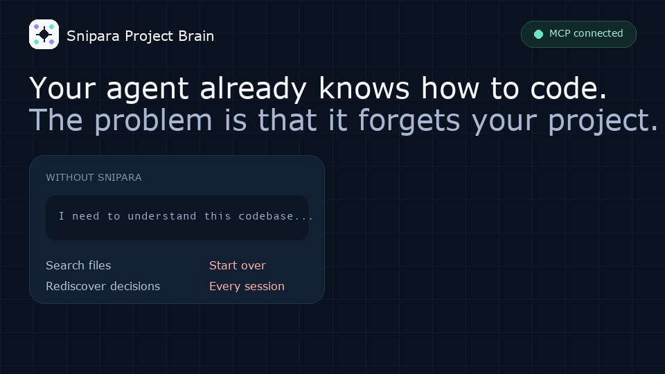
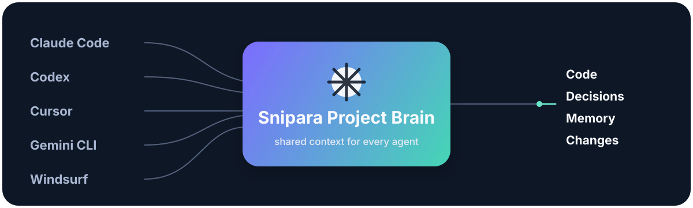

<p align="center">
  <picture>
    <source media="(prefers-color-scheme: dark)" srcset="assets/brand-logo-v2-inverted.png">
    <source media="(prefers-color-scheme: light)" srcset="assets/brand-logo-v2-transparent.png">
    
  </picture>
</p>

<h1 align="center">Snipara</h1>

<p align="center"><strong>The open-source Project Brain for AI coding agents</strong></p>

<p align="center">Claude Code · Codex · Cursor · Gemini CLI · Windsurf · MCP</p>

<p align="center">
  <a href="https://github.com/Snipara/snipara-server/actions/workflows/ci.yml"></a>
  <a href="LICENSE"></a>
  <a href="LICENSE"></a>
  <a href="#self-hosted-quickstart"></a>
  <a href="https://modelcontextprotocol.io/"></a>
  <a href="pyproject.toml"></a>
</p>

<p align="center"><a href="#get-started"><strong>Get started in one command ↓</strong></a></p>

Your agent already knows how to code. The problem is that it forgets your
project.

Snipara gives Claude Code, Codex, Cursor, Gemini CLI, Windsurf, and any MCP
client a shared project memory: decisions, changes, relevant code, and work
from other agents.

<p align="center">
  
</p>

The public server is designed to run on infrastructure you control. Documents,
embeddings, memories, logs and usage records stay in your PostgreSQL database.
No Snipara Cloud account or hosted service is required for self-hosting.

## Get started

The same activation engine works with Snipara Cloud or with an existing local
Snipara Server. Both paths seed the project and verify a first Project Brain
answer so the first run proves the workflow instead of only installing files.

### Cloud

From the project you want to connect:

```bash
npx create-snipara@latest
```

The default path connects to Snipara Cloud, writes the agent MCP configuration,
seeds a small README/docs corpus, and verifies a first project-grounded answer.

### Self-hosted

Start the server locally, then connect the same activation engine:

```bash
./scripts/quickstart.sh
```

```bash
export SNIPARA_LOCAL_API_KEY="<your-local-key>"
npx create-snipara@latest --self-hosted \
  --server-url http://localhost:8000/mcp/local \
  --api-key "$SNIPARA_LOCAL_API_KEY"
```

Both paths aim to finish with: endpoint connected, repository seed submitted,
and first Project Brain answer verified.

## Why it matters

| Without Snipara | With Snipara |
| --- | --- |
| New session starts from a task description | New session starts from project memory |
| Agent searches broadly and rediscovers decisions | Agent retrieves decisions, changes, and relevant code |
| Work from other agents is invisible | Every connected agent can build on the same context |

<p align="center">
  
</p>

## What the Project Brain remembers

- **Decisions** — why the project chose a design, dependency, or boundary.
- **Changes** — what moved, which files matter, and what another agent already did.
- **Code** — relevant project structure, symbols, and impact paths.
- **Memory** — durable project context and session continuity.

## What is included

- FastAPI REST and streamable HTTP MCP transport
- project-local documents, chunks, summaries and embeddings
- persistent memory, decisions and session context
- optional code graph and multi-agent coordination tools
- PostgreSQL + pgvector and Redis local Compose services
- local API-key authentication and local-only usage tracking
- tests, Docker build and a reproducible local setup

Public compatibility contract: `snipara-server-oss-v2`.

## What is deliberately excluded

The public server is not the Snipara Cloud application. It does not include
the web UI, login/OAuth/device flow, SaaS multi-tenancy, billing, plans,
resellers, partners, integrator administration, customer analytics or private
deployment secrets.

Those surfaces remain in the private Cloud repository and consume tagged,
immutable Snipara Server releases.

## Self-hosted quickstart

The one-command bootstrap creates a local API key, starts PostgreSQL, Redis, and
Snipara, initializes a local workspace, and prints the MCP endpoint:

```bash
./scripts/quickstart.sh
```

For an explicit, step-by-step setup:

```bash
cp .env.example .env
# Replace the placeholder SNIPARA_LOCAL_API_KEY with a long random value.
docker compose up -d --build
docker compose exec -T snipara bash /app/scripts/setup.sh
```

Check the server:

```bash
curl http://localhost:8000/health
curl http://localhost:8000/ready
```

The local MCP endpoint is `http://localhost:8000/mcp/local` and the public
capability contract is available at `http://localhost:8000/capabilities`.

Example MCP configuration:

```json
{
  "mcpServers": {
    "snipara": {
      "type": "http",
      "url": "http://localhost:8000/mcp/local",
      "headers": {
        "X-API-Key": "<SNIPARA_LOCAL_API_KEY>"
      }
    }
  }
}
```

## Configuration

Required:

- DATABASE_URL
- SNIPARA_LOCAL_API_KEY

Recommended local services:

- REDIS_URL for distributed rate limits, cache and event streaming
- CORS_ALLOWED_ORIGINS when a browser client is used

Optional:

- PRELOAD_EMBEDDINGS=false to load models lazily
- EMBEDDING_SERVICE_URL for an operator-managed embedding service
- SENTRY_DSN only when the operator explicitly opts in to external error
  reporting
- USAGE_TRACKING_ENABLED=false to disable the local PostgreSQL query ledger

Never put real keys, customer data or provider credentials in Git.

## Proof and verification

The public evidence is deliberately split between server verification and
product-level evaluation. Product results are not a performance guarantee for
every self-hosted deployment; they show the narrower conditions under which
Snipara's context and continuity workflows were measured.

### This repository

The current public server release has been checked with:

- **477 Python tests** passing, plus the OSS boundary verifier.
- **102 public MCP tools** exposed by the `snipara-server-oss-v2` contract, with
  no Cloud-only routes or `external_user_id` surface.
- **Docker image**, Python package, and Prisma schema validation passing locally.
- The same `lint`, `test`, and Docker build gates run in
  [GitHub Actions](https://github.com/Snipara/snipara-server/actions).

These are compatibility and release checks, not a claim that a fresh install
has been benchmarked on your corpus. Run the boundary check yourself with:

```bash
python scripts/verify_oss_boundary.py
pytest -q
```

### Public product evidence

- **Project continuity proof replay:** six continuity-heavy coding scenarios,
  repeated ten times per model. Aggregate passes moved from **25/180 to
  179/180** for Codex CLI and from **7/120 to 120/120** for Claude; local
  models moved from **0/180 to 170/180**. The replay measures project-history-
  dependent work, not generic coding ability, and its negative control is not
  published yet. See the [proof page](https://www.snipara.com/proof) and the
  [dated evidence summary](https://github.com/Snipara/snipara-examples/tree/main/proof/project-continuity-2026-07).
- **Hosted context benchmark:** a frozen 12-case GPT-4.1 run measured a mean
  context of **6,317 tokens versus 32,000** for a fixed first-window baseline
  (**80.26% less**), with answer quality **9.15/10 versus 8.30/10** and
  factual accuracy **93.0% versus 69.9%**. It is one run per task, not a
  universal model leaderboard. Recompute the committed result with the
  standard-library verifier in the
  [public benchmark pack](https://github.com/Snipara/snipara-examples/tree/main/benchmarks/hosted-context-2026-06).

## Development

```bash
python -m pip install -e ".[dev]"
prisma generate --schema prisma/schema.prisma
DATABASE_URL="postgresql://..." prisma validate --schema prisma/schema.prisma
ruff check src tests
pytest -q
```

prisma db push is supported by scripts/init-db.sh for a fresh local database
only. Production Cloud schema changes use the private migration path.

## License

Snipara Server is licensed under Apache-2.0. See [LICENSE](LICENSE) and
[docs/LICENSING.md](docs/LICENSING.md).

## Documentation

- [Architecture](docs/ARCHITECTURE.md)
- [OSS boundary and compatibility schema](docs/OSS_BOUNDARY.md)
- [Releasing](docs/RELEASING.md)
- [Deployment](docs/DEPLOYMENT.md)
- [Licensing](docs/LICENSING.md)
- [Contributing](CONTRIBUTING.md)
- [Security policy](SECURITY.md)
