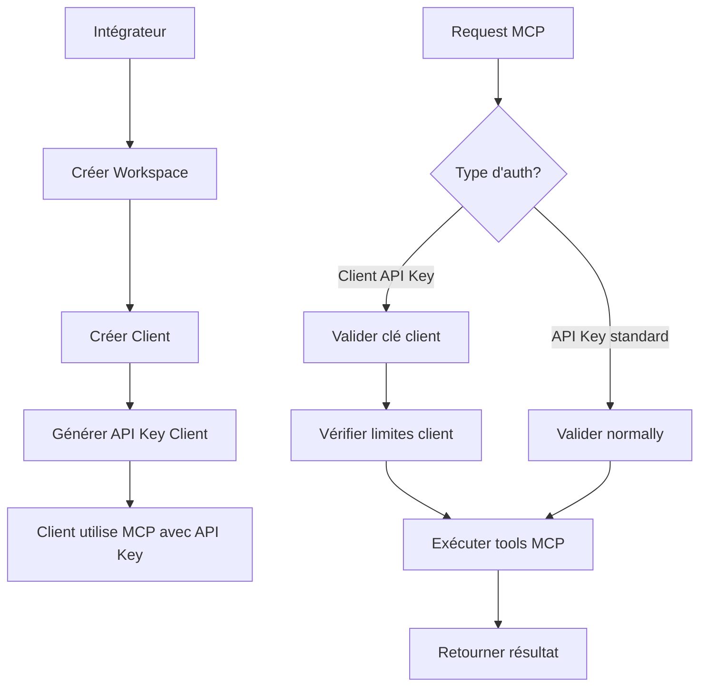

# Intégrateur Snipara - Documentation Complète

> Guide complet pour le système d'intégration Snipara permettant aux tiers d'intégrer Snipara pour leurs clients.

---

## Table des Matières

1. [Vue d'Ensemble](#vue-densemble)
2. [Architecture](#architecture)
3. [Schéma de Base de Données](#schéma-de-base-de-données)
4. [API d'Administration](#api-dadministration)
5. [API Client](#api-client)
6. [Authentification](#authentification)
7. [Limites et Quotas](#limites-et-quotas)
8. [Guide d'Intégration](#guide-dintégration)
9. [Modifications du Code Existant](#modifications-du-code-existant)

---

## Vue d'Ensemble

Le système intégrateur permet aux partenaires tiers de créer et gérer des comptes clients isolés au sein de leur propre workspace Snipara. Chaque client dispose de ressources dédiées (mémoire, swarms, agents) avec des limites configurables.

### Cas d'Usage Typiques

- **SaaS White-label**: Un éditeur de logiciel intègre Snipara dans son produit
- **Agence**: Une agence de développement gère plusieurs clients
- **Plateforme**: Une marketplace offrant Snipara comme service à ses utilisateurs

### Caractéristiques Clés

- **Isolation des données** : Chaque client a son propre projet et ses propres ressources
- **Gestion centralisée** : L'intégrateur gère tous ses clients via une API unifiée
- **API keys dédiées** : Chaque client a ses propres clés d'API
- **Limites flexibles** : Configuration par client (1 mémoire, 1 swarm, 20 agents)

---

## Architecture

### Hiérarchie du Système

```
Snipara Platform
│
├── User (Propriétaire du compte Snipara)
│   └── Integrator (Plan INTEGRATOR requis)
│       │
│       └── Workspace (Regroupement logique)
│           │
│           └── Client 1..N (Compte client)
│               │
│               └── Project (Projet dédié)
│                   │
│                   ├── AgentMemory (1 mémoire max)
│                   ├── AgentSwarm (1 swarm max)
│                   │   └── SwarmAgent (max 20 agents)
│                   └── Documents
```

### Diagramme de Flux



---

## Schéma de Base de Données

### Modèles à Ajouter

#### 1. Integrator

```prisma
model Integrator {
  id              String   @id @default(cuid())
  ownerId         String   // User qui possède l'intégration
  plan            IntegratorPlan @default(BASIC)
  
  // Limites du plan intégrateur
  clientLimit     Int      @default(10)
  
  // Billing
  stripeCustomerId     String?
  stripeSubscriptionId String?
  
  // Relations
  workspace       Workspace?
  clients         Client[]
  
  createdAt       DateTime @default(now())
  updatedAt       DateTime @updatedAt
  
  @@map("integrators")
  @@schema("tenant_snipara")
}

enum IntegratorPlan {
  BASIC       // 10 clients max
  PRO         // 50 clients max
  BUSINESS    // 200 clients max
  ENTERPRISE  // Illimité (sur devis)
}
```

#### 2. Workspace

```prisma
model Workspace {
  id            String   @id @default(cuid())
  name          String
  slug          String   @unique
  description   String?
  
  // Relations
  integratorId  String   @unique
  integrator    Integrator @relation(fields: [integratorId], references: [id], onDelete: Cascade)
  clients       Client[]
  
  createdAt     DateTime @default(now())
  updatedAt     DateTime @updatedAt
  
  @@map("workspaces")
  @@schema("tenant_snipara")
}
```

#### 3. Client

```prisma
model Client {
  id            String   @id @default(cuid())
  name          String
  email         String   // Email du client
  externalId    String?  // ID dans le système tiers
  
  // Bundle choisi pour ce client
  bundle        ClientBundle @default(STARTER)
  
  // Configuration
  isActive      Boolean  @default(true)
  
  // Relations
  workspaceId   String
  workspace     Workspace @relation(fields: [workspaceId], references: [id], onDelete: Cascade)
  project       Project?  // 1 projet par client
  apiKey        ClientApiKey?
  
  createdAt     DateTime @default(now())
  updatedAt     DateTime @updatedAt
  
  @@unique([workspaceId, email])
  @@unique([workspaceId, externalId])
  @@map("clients")
  @@schema("tenant_snipara")
}

enum ClientBundle {
  STARTER     // 100 queries, 100 memories, 2 agents
  PRO         // 1000 queries, 500 memories, 5 agents
  TEAM        // 5000 queries, illimité memories, 20 agents
  ENTERPRISE  // Illimité, 50 agents
}
```

#### 4. ClientApiKey

```prisma
model ClientApiKey {
  id          String   @id @default(cuid())
  clientId    String   @unique
  client      Client   @relation(fields: [clientId], references: [id], onDelete: Cascade)
  
  keyHash     String   @unique
  keyPrefix   String
  name        String   // "Production", "Development", etc.
  
  permissions Json     @default("[]") // Limites spécifiques
  rateLimit   Int?     // Requêtes/minute (null = défaut)
  
  lastUsedAt  DateTime?
  expiresAt   DateTime?
  revokedAt   DateTime?
  createdAt   DateTime @default(now())
  
  @@map("client_api_keys")
  @@schema("tenant_snipara")
}
```

### Modifications des Modèles Existants

#### Project

```prisma
model Project {
  // ... champs existants ...
  
  // Nouveau : lien optionnel vers un client intégrateur
  clientId      String?
  client        Client?  @relation(fields: [clientId], references: [id])
  
  @@map("projects")
  @@schema("tenant_snipara")
}
```

#### AgentsSubscription

```prisma
model AgentsSubscription {
  // ... champs existants ...
  
  // Nouveau : support intégrateur
  isIntegrator  Boolean @default(false)
  integratorId  String?
  integrator    Integrator? @relation(fields=[integratorId], references=[id])
}
```

---

## API d'Administration

### Base URL

```
https://api.snipara.com/v1/integrator
```

### Authentification

Toutes les routes d'administration nécessitent une authentication via l'API key standard du propriétaire (`rlm_...`).

```
Header: X-API-Key: rlm_votre_cle_api
```

### Endpoints

#### 1. Créer un Workspace

```http
POST /workspace
Content-Type: application/json

{
  "name": "Mon Workspace",
  "description": "Workspace pour mes clients"
}
```

**Réponse (201 Created):**

```json
{
  "success": true,
  "data": {
    "workspace_id": "clx123abc",
    "slug": "mon-workspace",
    "created_at": "2024-01-15T10:30:00Z"
  }
}
```

**Erreurs:**
- `400`: Vous avez déjà un workspace intégrateur
- `401`: Clé API invalide

---

#### 2. Lister les Workspaces

```http
GET /workspaces
```

**Réponse (200 OK):**

```json
{
  "success": true,
  "data": [
    {
      "workspace_id": "clx123abc",
      "name": "Mon Workspace",
      "slug": "mon-workspace",
      "client_count": 5,
      "plan": "PRO",
      "created_at": "2024-01-15T10:30:00Z"
    }
  ]
}
```

---

#### 3. Créer un Client

```http
POST /workspace/{workspace_id}/clients
Content-Type: application/json

{
  "name": "Client Entreprise ABC",
  "email": "contact@abc.com",
  "external_id": "abc-12345",
  "bundle": "PRO"  // STARTER, PRO, TEAM, ENTERPRISE
}
```

**Réponse (201 Created):**

```json
{
  "success": true,
  "data": {
    "client_id": "clt456def",
    "project_id": "prj789ghi",
    "project_slug": "client-entreprise-abc-project",
    "name": "Client Entreprise ABC",
    "email": "contact@abc.com",
    "bundle": "PRO",
    "resources": {
      "queries_per_month": 1000,
      "memories": 500,
      "agents": 5,
      "swarms": 5
    },
    "created_at": "2024-01-15T10:30:00Z"
  }
}
```

---

#### 4. Lister les Clients

```http
GET /workspace/{workspace_id}/clients
```

**Réponse (200 OK):**

```json
{
  "success": true,
  "data": [
    {
      "client_id": "clt456def",
      "name": "Client Entreprise ABC",
      "email": "contact@abc.com",
      "external_id": "abc-12345",
      "is_active": true,
      "project_id": "prj789ghi",
      "usage": {
        "memory_count": 0,
        "swarm_count": 0,
        "agent_count": 0
      },
      "created_at": "2024-01-15T10:30:00Z"
    }
  ],
  "pagination": {
    "total": 5,
    "limit": 20,
    "offset": 0
  }
}
```

---

#### 5. Obtenir les Statistiques d'Usage d'un Client

```http
GET /clients/{client_id}/usage
```

**Réponse (200 OK):**

```json
{
  "success": true,
  "data": {
    "client_id": "clt456def",
    "memory": {
      "current": 0,
      "limit": null,
      "unlimited": true
    },
    "swarms": {
      "current": 0,
      "limit": 1,
      "available": true
    },
    "agents": {
      "current": 0,
      "limit": 20,
      "available": true
    }
  }
}
```

---

#### 6. Créer une API Key Client

```http
POST /clients/{client_id}/api-keys
Content-Type: application/json

{
  "name": "Production",
  "permissions": {
    "max_agents": 20,
    "rate_limit": 100
  },
  "expires_at": "2025-01-15T10:30:00Z"
}
```

**Réponse (201 Created):**

```json
{
  "success": true,
  "data": {
    "api_key": "snipara_ic_abc123def456ghi789jkl012mno345p",
    "key_prefix": "snipara_ic_abc123def",
    "name": "Production",
    "expires_at": "2025-01-15T10:30:00Z",
    "permissions": {
      "max_agents": 20,
      "rate_limit": 100
    }
  }
}
```

> ⚠️ **IMPORTANT**: La clé API complète n'est affichée qu'une seule fois lors de la création. Sauvegardez-la immédiatement.

---

#### 7. Lister les API Keys Client

```http
GET /clients/{client_id}/api-keys
```

**Réponse (200 OK):**

```json
{
  "success": true,
  "data": [
    {
      "key_id": "key789xyz",
      "name": "Production",
      "key_prefix": "snipara_ic_abc123def",
      "permissions": {
        "max_agents": 20,
        "rate_limit": 100
      },
      "last_used_at": "2024-01-15T15:30:00Z",
      "expires_at": "2025-01-15T10:30:00Z",
      "revoked_at": null,
      "created_at": "2024-01-15T10:30:00Z"
    }
  ]
}
```

---

#### 8. Révoquer une API Key

```http
DELETE /clients/{client_id}/api-keys/{key_id}
```

**Réponse (200 OK):**

```json
{
  "success": true,
  "message": "API key révoquée avec succès"
}
```

---

#### 9. Désactiver un Client

```http
PATCH /clients/{client_id}
Content-Type: application/json

{
  "is_active": false
}
```

**Réponse (200 OK):**

```json
{
  "success": true,
  "message": "Client désactivé"
}
```

---

#### 10. Supprimer un Client

```http
DELETE /clients/{client_id}
```

> ⚠️ **WARNING**: Cette action est irréversible. Toutes les données du client (mémoires, swarms, documents) seront supprimées.

**Réponse (200 OK):**

```json
{
  "success": true,
  "message": "Client et toutes ses données supprimés"
}
```

---

## API Client

Les clients utilisent le même endpoint MCP que les utilisateurs standard, mais avec leur propre clé API.

### Endpoint MCP

```http
POST https://api.snipara.com/v1/{project_id}/mcp
```

### Authentication

```
Header: X-API-Key: snipara_ic_votre_cle_client
```

> Note: Les clés client utilisent le préfixe `snipara_ic_` (Snipara Integrator Client).

### Exemple de Request MCP

```json
{
  "tool": "rlm_context_query",
  "params": {
    "query": "Comment configurer l'authentification?",
    "max_tokens": 4000
  }
}
```

### Outils MCP Supportés pour les Clients

| Outil | Supporté | Notes |
|-------|---------|-------|
| `rlm_context_query` | ✅ | Recherche documentaire |
| `rlm_remember` | ✅ | 1 mémoire max par client |
| `rlm_recall` | ✅ | Récupération mémoire |
| `rlm_swarm_create` | ✅ | 1 swarm max |
| `rlm_swarm_join` | ✅ | Max 20 agents |
| `rlm_task_create` | ✅ | Gestion tâches |
| `rlm_claim` | ✅ | Ressources exclusives |
| `rlm_release` | ✅ | Libération ressources |

---

## Pricing (Tarification)

Le système intégrateur utilise une tarification simple basée sur :
1. **Frais d'accès intégrateur** : Accès aux APIs d'administration
2. **Bundle par client** : Chaque client inclut Context + Agents

### Architecture de Billing

```
Intégrateur
│
├── Frais d'accès intégrateur (1x)
│   ├── API administration
│   ├── Dashboard gestion
│   └── Analytics & monitoring
│
└── Bundle Client (N x)
    ├── Snipara Context
    ├── Snipara Agents
    └── Usage mensuel inclus
```

### 1. Frais d'Accès Intégrateur

| Plan | Accès APIs | Prix/Mois |
|------|------------|-----------|
| **BASIC** | 10 clients max | 199€/mois |
| **PRO** | 50 clients max | 499€/mois |
| **BUSINESS** | 200 clients max | 1499€/mois |
| **ENTERPRISE** | Illimité | Sur devis |

**Inclus :**
- APIs d'administration intégrateur
- Dashboard de gestion des clients
- Analytics et monitoring
- Support dédié
- SLA 99.9%

### 2. Bundle Client (Context + Agents)

Chaque client intégré dispose d'un bundle mensuel incluant les deux produits :

| Bundle Client | Context | Agents | Prix/Client/Mois |
|---------------|---------|--------|------------------|
| **STARTER** | 100 queries/mois | 100 memories, 2 agents | 29€/client |
| **PRO** | 1,000 queries/mois | 500 memories, 5 agents | 59€/client |
| **TEAM** | 5,000 queries/mois | Illimité memories, 20 agents | 99€/client |
| **ENTERPRISE** | Illimité | Illimité, 50 agents | 199€/client |

#### Ressources Incluses par Bundle

| Ressource | STARTER | PRO | TEAM | ENTERPRISE |
|-----------|---------|-----|------|------------|
| Queries/mois | 100 | 1,000 | 5,000 | Illimité |
| Mémoires | 100 | 500 | Illimité | Illimité |
| Documents | 10 | 50 | 200 | Illimité |
| Swarms | 1 | 5 | 20 | Illimité |
| Agents/swarm | 2 | 5 | 20 | 50 |
| Stockage | 100MB | 1GB | 10GB | 100GB |

### 3. Remises Volume (Basées sur le Plan Intégrateur)

| Plan Intégrateur | Remise Bundle Client |
|------------------|---------------------|
| BASIC | Prix standard |
| PRO | -10% sur bundle |
| BUSINESS | -20% sur bundle |
| ENTERPRISE | -30% sur bundle + remises additionnelles |

#### Prix Effectifs par Bundle

| Bundle Client | BASIC | PRO | BUSINESS | ENTERPRISE |
|---------------|-------|-----|----------|------------|
| STARTER | 29€ | 26€ | 23€ | 20€ |
| PRO | 59€ | 53€ | 47€ | 41€ |
| TEAM | 99€ | 89€ | 79€ | 69€ |
| ENTERPRISE | 199€ | 179€ | 159€ | 139€ |

### 4. Exemples de Calcul

#### Scénario 1 : Startup (BASIC + 5 clients PRO)
```
Frais intégrateur BASIC:        199€/mois
5 × PRO bundle (59€):          295€/mois
└─ Total mensuel:              494€/mois
soit 98.80€/mois par client
```

#### Scénario 2 : Agence (PRO + 30 clients TEAM)
```
Frais intégrateur PRO:         499€/mois
30 × TEAM bundle (89€):       2670€/mois
└─ Total mensuel:             3169€/mois
soit 105.63€/mois par client
```

#### Scénario 3 : Plateforme (BUSINESS + 150 clients ENTERPRISE)
```
Frais intégrateur BUSINESS:   1499€/mois
150 × ENTERPRISE (159€):     23850€/mois
└─ Total mensuel:            25349€/mois
soit 168.99€/mois par client
```

### 5. Fonctionnement avec Stripe

#### Activation du Plan Intégrateur

```python
POST /integrator/activate-plan
{
  "plan": "PRO",
  "stripe_payment_method_id": "pm_xxx",
  "billing_interval": "monthly"
}
```

#### Création de Client avec Bundle

```python
POST /workspace/{workspace_id}/clients
{
  "name": "Client ABC",
  "email": "contact@abc.com",
  "bundle": "PRO"  # STARTER, PRO, TEAM, ENTERPRISE
}
```

#### Facturation Mensuelle

Les clients intégrés sont facturés **via l'intégrateur** (pas de Stripe direct pour les clients finaux).

```python
GET /integrator/billing?period=2024-01

# Réponse
{
  "period": "2024-01",
  "integrator_plan": "PRO",
  "integrator_fee": 499.00,
  "clients": [
    {
      "client_id": "clt123",
      "name": "Client ABC",
      "bundle": "TEAM",
      "usage": {
        "queries": 1520,
        "memories": 45,
        "agents": 3
      },
      "bundle_price": 89.00,
      "overage": 0.00
    }
  ],
  "subtotal": 89.00,
  "volume_discount": 0.00,
  "integrator_fee": 499.00,
  "total": 588.00
}
```

### 6. Cycle de Facturation

| Événement | Timing |
|-----------|--------|
| Facture intégrateur | 1er de chaque mois |
| Prorata premier mois | Proportionnel aux jours restants |
| Ajout client | Prorata immédiat |
| Annulation plan | Fin du mois en cours |
| Upgrade bundle client | Prorata immédiat |

### 7. Comparaison avec Prix Standard

| Bundle | Prix Intégrateur | Prix Standard (Context + Agents) | Économie |
|--------|------------------|----------------------------------|----------|
| STARTER | 29€ | 64€ (15€ + 49€) | -55% |
| PRO | 59€ | 88€ (19€ + 69€) | -33% |
| TEAM | 99€ | 148€ (49€ + 99€) | -33% |
| ENTERPRISE | 199€ | 348€ (99€ + 249€) | -43% |

---

## Authentification

### Types de Clés API

| Type | Préfixe | Usage |
|------|---------|-------|
| Standard | `rlm_` | Propriétaire, projets personnels |
| Team | `rlm_team_` | Équipe, tous les projets |
| Intégrateur Client | `snipara_ic_` | Client intégrateur |

### Validation des Clés Client

```python
# src/auth.py

async def validate_client_api_key(api_key: str, project_id: str) -> dict | None:
    """
    Valide une clé API client et vérifie l'accès au projet.
    
    Args:
        api_key: La clé API du client (doit commencer par snipara_ic_)
        project_id: Le projet demandé
        
    Returns:
        Dict avec info client si valide, None sinon
    """
    if not api_key.startswith("snipara_ic_"):
        return None
    
    key_prefix = api_key[:16]
    client_key = await db.clientapikey.find_unique(
        where={"keyPrefix": key_prefix}
    )
    
    if not client_key:
        return None
    
    # Vérifier expiration/révocation
    if client_key.revokedAt:
        return None
    
    if client_key.expiresAt and client_key.expiresAt < datetime.now(UTC):
        return None
    
    # Vérifier que le projet appartient au client
    if client_key.client.projectId != project_id:
        return None
    
    return {
        "client_id": client_key.clientId,
        "client_name": client_key.client.name,
        "permissions": client_key.permissions,
    }
```

---

## Limites et Quotas

### Limites par Plan Intégrateur

| Plan | Clients Max | Agents/Client |
|------|-------------|---------------|
| STARTER | 5 | 5 |
| PRO | 25 | 10 |
| TEAM | 100 | 20 |
| ENTERPRISE | Illimité | 20 |

### Limites par Client

| Ressource | Défaut | Maximum |
|-----------|--------|---------|
| Mémoires | 1 | 1 |
| Swarms | 1 | 1 |
| Agents/swarm | 20 | 20 |
| Documents | Selon plan | Selon plan |

### Vérification des Limites

```python
# src/services/integrator_limits.py

async def check_client_memory_limit(client_id: str, count: int = 1) -> tuple[bool, str | None]:
    """Vérifie si le client peut créer de nouvelles mémoires."""
    client = await db.client.find_unique(
        where={"id": client_id},
        include={"workspace": {"include": {"integrator": True}}}
    )
    
    # Les clients intégrateur ont exactement 1 mémoire
    if client.memoryLimit is None:
        limit = 1  # Défaut
    else:
        limit = client.memoryLimit
    
    current = await db.agentmemory.count(
        where={"projectId": client.projectId}
    )
    
    if current >= limit:
        return False, f"Limite mémoire atteinte ({current}/{limit})"
    
    return True, None


async def check_client_swarm_limit(client_id: str) -> tuple[bool, str | None]:
    """Vérifie si le client peut créer un nouveau swarm."""
    client = await db.client.find_unique(...)
    
    limit = client.swarmLimit or 1  # 1 swarm par défaut
    
    current = await db.agentswarm.count(
        where={"projectId": client.projectId, "isActive": True}
    )
    
    if current >= limit:
        return False, f"Limite swarm atteinte ({current}/{limit})"
    
    return True, None


async def check_swarm_agent_limit(swarm_id: str, client_id: str) -> tuple[bool, str | None]:
    """Vérifie si le swarm peut accepter plus d'agents."""
    client = await db.client.find_unique(where={"id": client_id})
    
    limit = min(client.agentLimit or 20, 20)  # Max 20 agents
    
    current = await db.swarmagent.count(
        where={"swarmId": swarm_id, "isActive": True}
    )
    
    if current >= limit:
        return False, f"Limite agents atteinte ({current}/{limit})"
    
    return True, None
```

---

## Guide d'Intégration

### 1. Initialisation du Workspace

```python
import requests

API_BASE = "https://api.snipara.com/v1/integrator"
ADMIN_API_KEY = "rlm_votre_cle_admin"

headers = {
    "X-API-Key": ADMIN_API_KEY,
    "Content-Type": "application/json"
}

# Créer le workspace
response = requests.post(
    f"{API_BASE}/workspace",
    json={
        "name": "SaaS Platform",
        "description": "Workspace pour notre plateforme SaaS"
    },
    headers=headers
)

workspace = response.json()["data"]
print(f"Workspace créé: {workspace['workspace_id']}")
```

### 2. Création Automatique de Clients

```python
def create_client(workspace_id: str, customer_data: dict) -> dict:
    """Crée un nouveau client pour un client final."""
    response = requests.post(
        f"{API_BASE}/workspace/{workspace_id}/clients",
        json={
            "name": customer_data["company_name"],
            "email": customer_data["email"],
            "external_id": customer_data["id"],  # ID dans votre système
            "agent_limit": 20  # Max agents pour ce client
        },
        headers=headers
    )
    return response.json()["data"]

# Usage
client = create_client(
    workspace_id="clx123abc",
    customer_data={
        "id": "cust_12345",
        "company_name": "Entreprise ABC",
        "email": "admin@abc.com"
    }
)

print(f"Client créé: {client['client_id']}")
print(f"Project: {client['project_slug']}")
```

### 3. Génération de Clé API pour le Client

```python
def generate_client_api_key(client_id: str, name: str) -> str:
    """Génère une clé API pour le client."""
    response = requests.post(
        f"{API_BASE}/clients/{client_id}/api-keys",
        json={"name": name},
        headers=headers
    )
    
    data = response.json()["data"]
    api_key = data["api_key"]
    
    # IMPORTANT: Sauvegarder la clé immédiatement
    save_api_key_for_customer(client_id, api_key)
    
    return api_key

# Usage
api_key = generate_client_api_key(
    client_id="clt456def",
    name="Production"
)
print(f"API Key: {api_key}")
```

### 4. Configuration Client MCP

Le client final configure son MCP avec la clé générée:

```json
{
  "mcpServers": {
    "snipara": {
      "command": "uvx",
      "args": ["snipara-mcp", "--api-key", "snipara_ic_abc123def456..."]
    }
  }
}
```

Ou via variable d'environnement:

```bash
export SNIPARA_API_KEY="snipara_ic_abc123def456..."
```

### 5. Surveillance de l'Usage

```python
def get_client_usage(client_id: str) -> dict:
    """Récupère les statistiques d'usage du client."""
    response = requests.get(
        f"{API_BASE}/clients/{client_id}/usage",
        headers=headers
    )
    return response.json()["data"]

# Usage
usage = get_client_usage("clt456def")
print(f"Mémoires: {usage['memory']['current']}/{usage['memory']['limit']}")
print(f"Swarms: {usage['swarms']['current']}/{usage['swarms']['limit']}")
print(f"Agents: {usage['agents']['current']}/{usage['agents']['limit']}")
```

---

## Modifications du Code Existant

### 1. Fichiers à Modifier

| Fichier | Modification |
|---------|-------------|
| `prisma/schema.prisma` | Ajouter modèles Integrator, Workspace, Client, ClientApiKey |
| `src/auth.py` | Ajouter `validate_client_api_key()` |
| `src/api/deps.py` | Ajouter validation client dans `validate_and_rate_limit` |
| `src/services/agent_limits.py` | Ajouter `check_client_*_limit()` |
| `src/engine/handlers/memory.py` | Valider limites client dans `rlm_remember` |
| `src/engine/handlers/swarm.py` | Valider limites client dans `rlm_swarm_create` |

### 2. Nouveaux Fichiers à Créer

| Fichier | Description |
|---------|-------------|
| `src/services/integrator.py` | Service de gestion intégrateur |
| `src/api/integrator.py` | Routes API administration intégrateur |
| `src/models/integrator.py` | Modèles Pydantic pour l'intégrateur |

### 3. Exemple de Modification - auth.py

```python
# src/auth.py

async def validate_api_key(api_key: str, project_id_or_slug: str) -> dict | None:
    """
    Validate an API key and check project access.
    
    Supports three types of keys:
    1. Project-specific keys (rlm_...)
    2. Team keys (rlm_team_...)
    3. Integrator client keys (snipara_ic_...)
    """
    # Check for integrator client key first
    if api_key.startswith("snipara_ic_"):
        return await validate_client_api_key(api_key, project_id_or_slug)
    
    # Existing logic for rlm_ and rlm_team_ keys
    return await validate_standard_api_key(api_key, project_id_or_slug)
```

### 4. Exemple de Modification - memory handler

```python
# src/engine/handlers/memory.py

async def handle_remember(project_id: str, params: dict) -> dict:
    """Handle rlm_remember tool with client limits."""
    
    # Check if project belongs to a client
    project = await db.project.find_unique(
        where={"id": project_id},
        include={"client": True}
    )
    
    if project.client:
        # Apply client memory limit (1 memory max)
        allowed, error = await check_client_memory_limit(
            project.clientId, count=1
        )
        if not allowed:
            return {
                "success": False,
                "error": error
            }
    
    # Continue with existing memory creation logic
    return await create_memory(project_id, params)
```

---

## Annexe

### Codes d'Erreur

| Code | Message | Description |
|------|---------|-------------|
| 400 | Limite de clients atteinte | Workspace plein |
| 400 | Client déjà existant | Email/external_id déjà utilisé |
| 401 | Clé API invalide | Clé inexpirante ou révoquée |
| 403 | Accès refusé | Le projet n'appartient pas au client |
| 404 | Client non trouvé | ID client invalide |
| 429 | Rate limit exceeded | Trop de requêtes |

### Format des Dates

Toutes les dates sont en format ISO 8601 UTC:

```
2024-01-15T10:30:00Z
```

### Rate Limiting

| Type | Limite |
|------|--------|
| Admin API | 60 requêtes/minute |
| Client MCP | 100 requêtes/minute (configurable) |

---

## 10. Isolation et Sécurité des Swarms

### Architecture d'Isolation

Les swarms sont **isolés par projet** dans le système Snipara. Chaque swarm est lié à un `project_id` spécifique, ce qui garantit que les clients ne peuvent pas accéder aux swarms d'autres clients.

```prisma
// Chaque swarm appartient à un projet
model AgentSwarm {
  id          String   @id @default(cuid())
  projectId   String   // ← Clé d'isolation
  name        String
  
  project     Project  @relation(fields: [projectId], references: [id])
  agents      SwarmAgent[]
  ...
}
```

### Validation de Sécurité Recommandée

Bien que le système fonctionne en pratique grâce à l'isolation par API key, il est recommandé d'ajouter une **validation explicite** dans les handlers pour renforcer la sécurité.

#### Exemple: Validation dans `handle_swarm_join`

```python
# src/engine/handlers/swarm.py

async def handle_swarm_join(
    params: dict[str, Any],
    ctx: HandlerContext,
) -> ToolResult:
    """Join a swarm with explicit project ownership validation."""
    swarm_id = params.get("swarm_id", "")
    agent_id = params.get("agent_id", "")

    if not swarm_id or not agent_id:
        missing = []
        if not swarm_id:
            missing.append("swarm_id")
        if not agent_id:
            missing.append("agent_id")
        return ToolResult(
            data={"error": f"rlm_swarm_join: missing required parameter(s): {', '.join(missing)}"},
            input_tokens=0,
            output_tokens=0,
        )

    # NOUVEAU: Valider que le swarm appartient au projet courant
    db = await get_db()
    swarm = await db.agentswarm.find_unique(where={"id": swarm_id})

    if not swarm:
        return ToolResult(
            data={"error": "Swarm non trouvé"},
            input_tokens=0,
            output_tokens=0,
        )

    if swarm.projectId != ctx.project_id:
        # Log de tentative d'accès non autorisé
        logger.warning(
            f"Tentative d'accès swarm {swarm_id} depuis projet {ctx.project_id} "
            f"(swarm appartient à {swarm.projectId})"
        )
        return ToolResult(
            data={"error": "Accès refusé: ce swarm n'appartient pas à votre projet"},
            input_tokens=0,
            output_tokens=0,
        )

    result = await join_swarm(
        swarm_id=swarm_id,
        agent_id=agent_id,
        role=params.get("role", "worker"),
        capabilities=params.get("capabilities"),
    )

    return ToolResult(
        data=result,
        input_tokens=0,
        output_tokens=count_tokens(str(result)),
    )
```

#### Exemple: Validation dans `handle_claim`

```python
async def handle_claim(
    params: dict[str, Any],
    ctx: HandlerContext,
) -> ToolResult:
    """Claim a resource with swarm ownership validation."""
    swarm_id = params.get("swarm_id", "")

    # Valider que le swarm appartient au projet
    db = await get_db()
    swarm = await db.agentswarm.find_unique(where={"id": swarm_id})

    if not swarm:
        return ToolResult(
            data={"error": "Swarm non trouvé"},
            input_tokens=0,
            output_tokens=0,
        )

    if swarm.projectId != ctx.project_id:
        logger.warning(
            f"Tentative de claim sur swarm {swarm_id} depuis projet {ctx.project_id}"
        )
        return ToolResult(
            data={"error": "Accès refusé: ce swarm n'appartient pas à votre projet"},
            input_tokens=0,
            output_tokens=0,
        )

    # Continue with existing claim logic...
```

### Limites des Swarms par Bundle Client

| Bundle | Swarms Max | Agents/Swarm |
|--------|------------|--------------|
| STARTER | 1 | 2 |
| PRO | 5 | 5 |
| TEAM | 20 | 20 |
| ENTERPRISE | **Illimité** | 50 |

### Bonnes Pratiques

1. **Nommez vos swarms de manière explicite** : Utilisez un naming convention qui inclut le contexte
   ```
   "frontend-refactor-swarm"
   "backend-api-review-swarm"
   ```

2. **Limitez les agents au nécessaire** : Plus d'agents = plus de coordination

3. **Utilisez les claims pour les ressources critiques** : Les fichiers partagés doivent être claimés

4. **定期清理非活跃的Swarms** : Désactivez les swarms terminés pour libérer des ressources

---

## Support

Pour toute question ou problème:
- Documentation: https://docs.snipara.com/integrator
- Support: support@snipara.com
